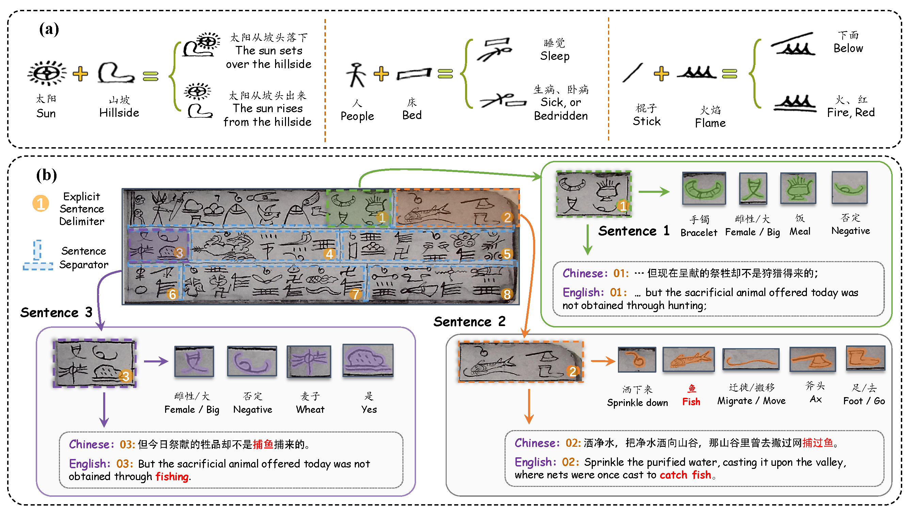

# 📜 Multimodal Translation of Dongba Script (Work in Progress)

---

## ✨ Overview
This repository will host resources related to our recent research on **machine translation of the endangered Dongba pictographic script**, leveraging **multimodal context** (e.g., images + text).  

The goal of this work is to explore **cross-modal understanding** for an ancient and endangered writing system, contributing to both **natural language processing** and **cultural heritage preservation**.  

📌 Status: **Under Review**  
📅 Preprint, code, and data will be released upon acceptance.  

## 📊 Illustration

  

*Example illustration from our study on Dongba pictogram translation.*

## 📢 Stay Tuned
- Preprint (planned)  
- Dataset and code release (planned)  
- More updates will be announced here   

## 📧 Contact
For inquiries or collaborations:  
- **Name:** Shuo Li
- **Email:** thinklis@hrbeu.edu.cn  
- **Institution:** Harbin Engineering University

---

  🔜 More details will be shared after acceptance. Stay tuned!

